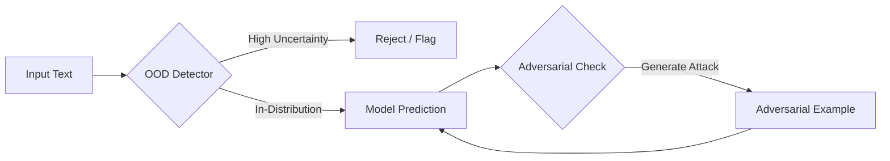

# Adversarial Robustness and OOD Detection

A production-grade demonstration of trust and safety mechanisms for AI models. This system integrates Out-of-Distribution (OOD) detection and adversarial attack generation to validate model robustness.


[](https://huggingface.co/spaces/Sakeeb/ai-trust-safety-demo)


## 🚀 Live Demo

**Try it now:** [AI Trust & Safety Demo on Hugging Face Spaces](https://huggingface.co/spaces/Sakeeb/ai-trust-safety-demo)

Interact with the system directly in your browser - no installation required!

## Overview

Deploying machine learning models safely requires more than just high accuracy. This project implements two critical safety layers:

1.  **Out-of-Distribution (OOD) Detection**: Identifies inputs that deviate significantly from the training data distribution, preventing confident but incorrect predictions on irrelevant content.
2.  **Adversarial Robustness**: Evaluates model vulnerability by generating adversarial examples—inputs intentionally perturbed to cause misclassification.

## Architecture



## Features

### OOD Detection
*   **Method**: Maximum Softmax Probability (MSP).
*   **Function**: Calculates a confidence score for every input. If the score falls below a calibrated threshold, the input is flagged as Out-of-Distribution.
*   **Use Case**: Distinguishing between relevant topic-based queries (e.g., Business, Sports) and irrelevant noise (e.g., Movie Reviews).

### Adversarial Attacks
*   **Method**: DeepWordBug (Character-level perturbations).
*   **Library**: TextAttack.
*   **Function**: Generates perturbed versions of valid inputs to test if the model's prediction can be flipped while maintaining human readability.

## Installation

Ensure you have Python 3.9 or higher installed.

```bash
# Clone the repository
git clone https://github.com/Sakeeb91/Adversarial-Robustness-and-OOD-Detection.git
cd Adversarial-Robustness-and-OOD-Detection

# Create and activate virtual environment
python3 -m venv venv_gradio
source venv_gradio/bin/activate

# Install dependencies
pip install torch transformers textattack gradio datasets numpy scikit-learn
```

> **Note**: The system uses the pre-trained model `textattack/distilbert-base-uncased-ag-news` from Hugging Face Hub, which will be automatically downloaded on first run.

## Usage

### 🌐 Online Demo (Recommended)
The easiest way to try the system is through the **[live Hugging Face Space](https://huggingface.co/spaces/Sakeeb/ai-trust-safety-demo)**.

### 💻 Local Web Interface (Gradio)
Launch the interactive web UI locally to visualize OOD detection and attacks.

```bash
# Activate environment
source venv_gradio/bin/activate
export PYTHONPATH=$PYTHONPATH:.

# Run the Gradio app
python app.py
```

Access at: http://127.0.0.1:7860

### Interactive Demo (CLI)
Launch the Command Line Interface (CLI) to interact with the system in real-time.

```bash
# Use the standard environment (or venv_gradio)
source venv/bin/activate # or venv_gradio
python src/app.py --interactive
```

**Example Session:**
```text
> Input: The stock market crashed today.
Status: IN-DISTRIBUTION
Prediction: Business (0.98)

Generating Adversarial Example...
Adversarial Text: 'The stcck market crashep today.'
Attack Successful: Label flipped!
```

### Verification Script
Run the automated verification suite to validate all components.

```bash
python verify_system.py
```

## Project Structure

*   `src/model.py`: DistilBERT model training and loading pipeline.
*   `src/ood.py`: Logic for OOD score calculation and thresholding.
*   `src/adversarial.py`: Adversarial attack generation using TextAttack.
*   `src/app.py`: Main entry point for the CLI application.
*   `verify_system.py`: Integration tests for system validation.

## Technology Stack

*   **Model**: `textattack/distilbert-base-uncased-ag-news` (94.8% accuracy)
*   **Framework**: PyTorch + Hugging Face Transformers
*   **Adversarial Tools**: TextAttack (DeepWordBug)
*   **Interface**: Gradio
*   **Training Data**: AG News (World, Sports, Business, Sci/Tech)
*   **OOD Test Data**: IMDB (Movie Reviews)

## Deployment

This project is deployed on **Hugging Face Spaces** for global accessibility:

🔗 **Live Demo**: https://huggingface.co/spaces/Sakeeb/ai-trust-safety-demo

The deployment uses a lightweight architecture (72KB) by loading the pre-trained model directly from Hugging Face Hub, eliminating the need to include large model files in the repository.

## Model Details

The system uses a fine-tuned DistilBERT model specifically trained for AG News classification:

- **Model ID**: `textattack/distilbert-base-uncased-ag-news`
- **Source**: Hugging Face Model Hub
- **Accuracy**: 94.8% on AG News test set
- **Classes**: 4 (World, Sports, Business, Sci/Tech)
- **Parameters**: ~67M
- **Size**: ~255MB

## Contributing

Contributions are welcome! Feel free to:
- Report bugs or issues
- Suggest new features or improvements
- Submit pull requests

## License

MIT License - see LICENSE file for details.

## Citation

If you use this project in your research or work, please cite:

```bibtex
@software{adversarial_ood_detection,
  author = {Sakeeb},
  title = {Adversarial Robustness and OOD Detection},
  year = {2025},
  url = {https://github.com/Sakeeb91/Adversarial-Robustness-and-OOD-Detection}
}
```
