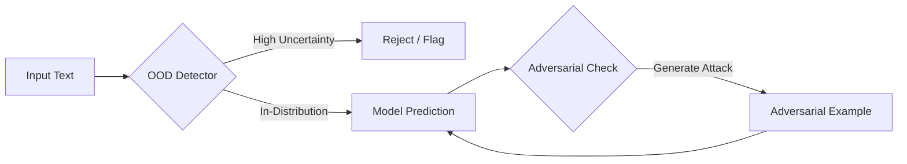

# Adversarial Robustness and OOD Detection

A production-grade demonstration of trust and safety mechanisms for AI models. This system integrates Out-of-Distribution (OOD) detection and adversarial attack generation to validate model robustness.


## Overview

Deploying machine learning models safely requires more than just high accuracy. This project implements two critical safety layers:

1.  **Out-of-Distribution (OOD) Detection**: Identifies inputs that deviate significantly from the training data distribution, preventing confident but incorrect predictions on irrelevant content.
2.  **Adversarial Robustness**: Evaluates model vulnerability by generating adversarial examples—inputs intentionally perturbed to cause misclassification.

## Architecture



## Features

### OOD Detection
*   **Method**: Maximum Softmax Probability (MSP).
*   **Function**: Calculates a confidence score for every input. If the score falls below a calibrated threshold, the input is flagged as Out-of-Distribution.
*   **Use Case**: Distinguishing between relevant topic-based queries (e.g., Business, Sports) and irrelevant noise (e.g., Movie Reviews).

### Adversarial Attacks
*   **Method**: DeepWordBug (Character-level perturbations).
*   **Library**: TextAttack.
*   **Function**: Generates perturbed versions of valid inputs to test if the model's prediction can be flipped while maintaining human readability.

## Installation

Ensure you have Python 3.9 or higher installed.

```bash
# Clone the repository
git clone <repository-url>
cd ood-detection

# Create and activate virtual environment
python3 -m venv venv
source venv/bin/activate

# Install dependencies
pip install -r requirements.txt
```

## Usage

### Web Interface (Gradio)
Launch the interactive web UI to visualize OOD detection and attacks.

```bash
# Use the compatible environment
source venv_gradio/bin/activate
export PYTHONPATH=$PYTHONPATH:.
python src/gradio_app.py
```

### Interactive Demo (CLI)
Launch the Command Line Interface (CLI) to interact with the system in real-time.

```bash
# Use the standard environment (or venv_gradio)
source venv/bin/activate # or venv_gradio
python src/app.py --interactive
```

**Example Session:**
```text
> Input: The stock market crashed today.
Status: IN-DISTRIBUTION
Prediction: Business (0.98)

Generating Adversarial Example...
Adversarial Text: 'The stcck market crashep today.'
Attack Successful: Label flipped!
```

### Verification Script
Run the automated verification suite to validate all components.

```bash
python verify_system.py
```

## Project Structure

*   `src/model.py`: DistilBERT model training and loading pipeline.
*   `src/ood.py`: Logic for OOD score calculation and thresholding.
*   `src/adversarial.py`: Adversarial attack generation using TextAttack.
*   `src/app.py`: Main entry point for the CLI application.
*   `verify_system.py`: Integration tests for system validation.

## Technology Stack

*   **Model**: Hugging Face Transformers (DistilBERT)
*   **Framework**: PyTorch
*   **Adversarial Tools**: TextAttack
*   **Data**: AG News (ID), IMDB (OOD)
